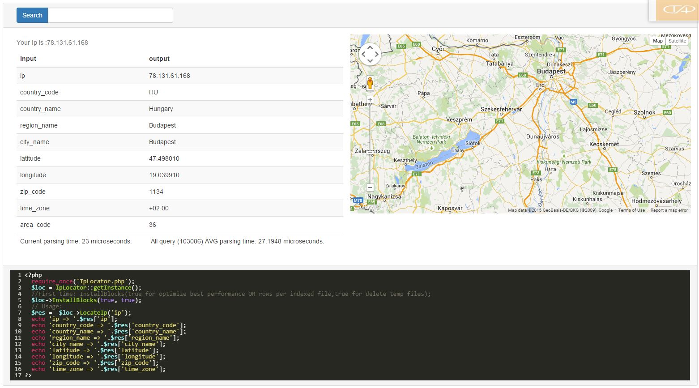

FastSpeedIpLocator
==================

Fast ip parsing from local file, using ip2Location CSV database.

- Very simple usage
- Working with all ip2Location database CSV version
- Parsing time close to mysql selection time
- IPV4 Or IPV6

[FastSpeedIpLocator] - Online Demo 



Version
----

1.0.0

Requirements
----
- PHP Web server 5.5 or above

Installation
----
- Copy whole folder (iplocator) to your web server.
- Download csv database from [ip2location], Lite is free!
- install blocks at first, -> index.php

index.php - example
--------------

```sh
<?php
	require_once ('IpLocator.php');
	if (isset($_POST['look']) && (isset($_POST['inp']) || $_POST['inp'] != '')) {
    	$curTime = microtime(true);
    	$loc = IpLocator::getInstance();
    	$res = $loc->LocateIp($_POST['inp']);
    	$elp = (round(microtime(true) - $curTime, 3) * 1000);
    	echo '<br>';
    	foreach ($res as $key => $value) {
        	echo $key . ' => ' . $value . '<br>';
    	}
    	echo '<br>';
    	echo 'Elpassed time: ' . $elp . ' Us';
	}
	$filename = 'update/*.[zZ][iI][pP]';
	if (isset($_POST['install']) && count(glob($filename)) > 0) {
		ini_set('max_execution_time', 300);
    	$loc = IpLocator::getInst	            
    	//InstallBlocks(true for optimize best performance OR rows per indexed file, true for delete temp files);15.6965
    	$loc->InstallBlocks(glob($filename) [0], true, true);
    	unset($loc);
    	exit;
	} 
	else if (isset($_POST['install']) && count(glob($filename)) === 0) {
    	echo 'Data file (update/*.ZIP) is not exist!<br>';
    	echo 'Register to <a href = "http://www.ip2location.com//">www.ip2location.com</a><br>';
    	echo 'Download IP Location Database CSV in Zip format and copy to update folder.';
	}
?>
```

License
----
MIT
Author: Tóth András
---
http://atandrastoth.co.uk/

2015-05-27
[FastSpeedIpLocator]:http://atandrastoth.co.uk/main/pages/phpclasses/iplocator/
[ip2location]:http://www.ip2location.com/

